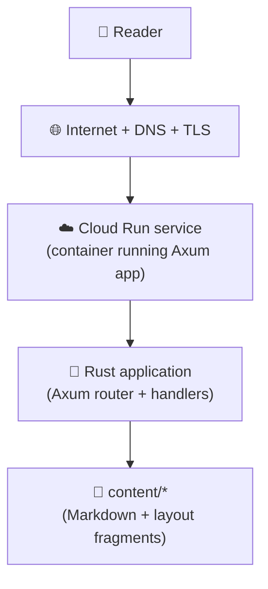
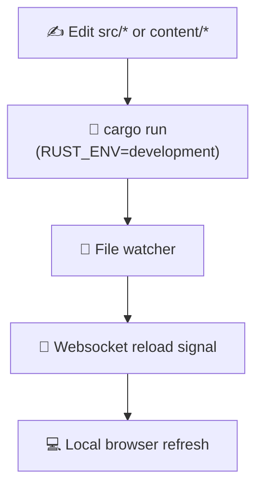
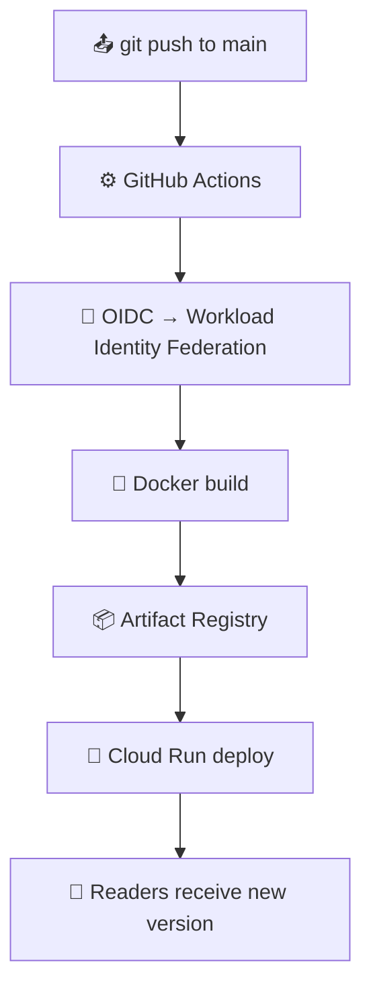

A blog is trivial.

Until you take the entire path seriously.

- local edit → browser refresh
- git push → build → deploy
- DNS → TLS → request routing
- content change → release artifact

This post describes the system as it exists **today**, and why each piece is there.

Not to run a blog.

To minimise the cost of change.

---

## Architecture at a glance



**Users** here means actual readers — someone opening the site in a browser.

They do not interact with GitHub.\
They do not know about CI.

They send an HTTP request.\
The container responds with HTML.

Everything else exists to support that moment.

---

## Developer loop (local)



In development mode:

- A file watcher monitors `content/`
- Changes trigger in-memory reload
- A websocket broadcasts `"reload"`
- The browser refreshes automatically

Edit. Save. See change.

No manual restart.
No rebuild for content tweaks.

Feedback loops stay short.

---

## Runtime responsibilities

At startup, the application:

- Loads `content/layout.html`
- Loads `content/banner.html`
- Loads `content/home.md`
- Scans `content/posts/*.md`
- Parses YAML front matter
- Renders Markdown to HTML

There is no database.

Content lives in git.\
State lives in files.

A post is simply:

```markdown
---
title: "Post title"
date: 2026-03-02
slug: 2026-03-02-example
---

Markdown body here.
```

Rendering is deliberately simple:

- Markdown → HTML (tables + math enabled)
- Layout placeholders replaced (`{{ banner }}`, `{{ content }}`, `{{ posts }}`)
- Full HTML page returned

No ORM.\
No CMS.\
No runtime mutation.

Constraint keeps surface area small.


---

## Development loop (production)




Push to `main`.

That is the release process.

GitHub Actions:

1. Authenticates to GCP using OIDC
(no stored service account keys)

2. Detects change type:
    - Full (code + content)
    - Content-only

3. Builds accordingly:

    **Full build**
    - Compile Rust
    - Build runtime image
    - Tag with commit SHA

    **Content-only build**
    - Overlay updated `content/`
    - Tag with commit SHA

4. Deploys to Cloud Run

Content changes ship without recompiling the binary.

That is deliberate.

Content is production change.\
It should not pay the full rebuild tax.

---

## Infrastructure

Infrastructure is declared in OpenTofu.

It provisions:

- Artifact Registry
- Cloud Run service
- Workload Identity Federation
- IAM bindings (least privilege)
- DNS records

There are no manual console steps in steady state.

If something exists, it is declared.

If it is not declared, it does not exist.

---

## Security posture

- No long-lived credentials in CI

- OIDC federation between GitHub and GCP

- Runtime container runs as non-root

- Multi-stage build to minimise attack surface

- Runtime does not require GCP API access

The container can serve traffic.

It cannot mutate infrastructure.

Boundaries matter.

---

## Why this design?

Most blogs optimise for features.

This one optimises for:

- Reproducibility
- Short feedback loops
- Low deploy friction
- Visible state
- Minimal moving parts

The interesting problem is not publishing text.

It is reducing the cost of safe change.

This system demonstrates:

- Content treated as deployable artifact
- CI/CD without stored secrets
- Infra-as-code as baseline
- Developer ergonomics as design constraint

---

## What this actually signals

The blog itself is not the point.

The system is.

It shows how I think about:

- Platform as a product
- Flow as a measurable property
- Security as default posture
- Change as the primary unit of engineering work

When implementation becomes commoditised, leverage shifts to architecture.

This is a small system.

Small systems reveal principles clearly.

And principles scale.
