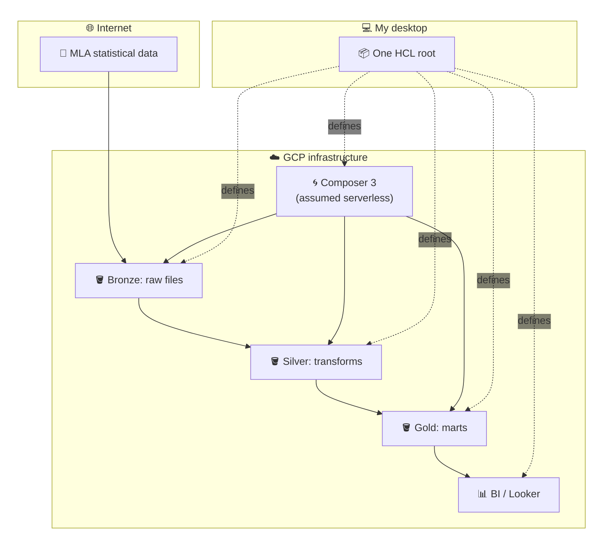
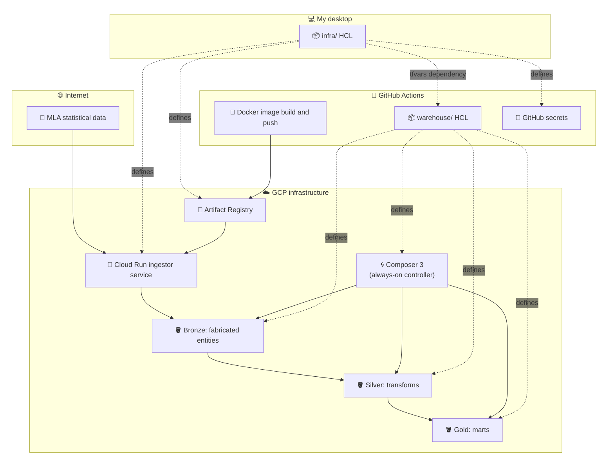

I built a small data platform for a meat distribution business I was
interviewing with. The goal was simple: ingest public livestock
statistics, model traceability from packaged product back to carcass
and animal, and expose it through a Lakehouse stack. It was meant to
be cheap, educational, and realistic, and it achieved all three. It
also exposed something more important: how easily the cost of change
hides inside “good practices.”

---

## The Intent

I wanted to learn:

- <a href="https://airflow.apache.org/" target="_blank" rel="noopener
  noreferrer">Apache Airflow</a>
- <a href="https://www.databricks.com/glossary/data-lakehouse"
  target="_blank" rel="noopener noreferrer">Lakehouse architecture</a>
- <a href="https://www.scalefree.com/consulting/data-vault-2-0/"
  target="_blank" rel="noopener noreferrer">Data Vault 2</a> and <a
  href="https://www.kimballgroup.com/data-warehouse-business-intelligence-resources/kimball-techniques/dimensional-modeling-techniques/star-schema-olap-cube/"
  target="_blank" rel="noopener noreferrer">Kimball</a> modelling
- <a href="https://www.ibm.com/think/topics/elt" target="_blank"
  rel="noopener noreferrer">ELT</a> ingestion patterns on <a
  href="https://cloud.google.com/" target="_blank" rel="noopener
  noreferrer">GCP</a>

This is the architecture I thought I was building:

<strong>Figure 1.</strong> Intended shape: raw source to layered refinement, with orchestration and infrastructure as supporting layers.

The ingestion logic pulled public <a
href="https://www.mla.com.au/prices-markets/statistics/api/"
target="_blank" rel="noopener noreferrer">MLA</a> statistical
data. Because the data was aggregate, I followed a suggestion to
synthesise carcasses so that totals matched official reporting. That
decision seemed harmless; it wasn’t.

---

## Synthetic Data, Real Coupling

By generating carcasses to match statistical aggregates, I introduced
a hidden constraint: the ingestion and modelling layers now had to
evolve together. The bronze layer no longer held raw source data; it
held interpreted, fabricated entities designed to satisfy reporting
totals. That pushed the pipeline into a _de facto_ <a
href="https://aws.amazon.com/what-is/etl/" target="_blank"
rel="noopener noreferrer">ETL</a> shape. Changing modelling
assumptions meant changing ingestion, and changing ingestion meant
rethinking the synthetic logic. The system worked, but nothing was
isolated anymore, and change was no longer cheap.

---

## The Illusion of Serverless

I chose <a
href="https://docs.cloud.google.com/composer/docs/composer-3/environment-architecture"
target="_blank" rel="noopener noreferrer">Cloud Composer 3</a> to
orchestrate Airflow, assuming “serverless.” <a
href="https://spark.apache.org/" target="_blank" rel="noopener
noreferrer">Spark</a> workers are ephemeral; the control plane is
not. “Serverless” described the workers, not the system.

Composer runs an always-on environment. The monetary cost was
acceptable as a learning expense. What I did not anticipate was the
feedback cost. Cloud orchestration debugging is slow. Iteration
becomes deliberate instead of fluid. Rebuilding an environment from
scratch becomes uncertain, because so many small adjustments happen
along the way.

Unless reproducibility is actively enforced, HCL projects accumulate
implicit knowledge: flags toggled during experimentation, sequencing
quirks, state nuances. After a while, no one dares to destroy and
recreate the stack to verify it truly works from zero. And if you
cannot destroy it safely, you cannot evolve it confidently.

The real cost was not the bill. It was the loss of confidence that I
could reshape the system quickly without paying weeks of focused
reconstruction.

---

## CI/CD as a Substitute for Local Feedback

I structured the repository with two HCL roots:

- `infra/` for GitHub secrets and base config
- `warehouse/` for the data warehouse stack

Changes were pushed to GitHub and applied via Actions. In theory, what
is in git is what is deployed. In practice, I did not get one
infrastructure problem; I got two. Running <a
href="https://opentofu.org/" target="_blank" rel="noopener
noreferrer">OpenTofu</a> in CI is not a replacement for testing
locally. For HCL, the local test is applying it. Best case, you apply
locally and CI confirms it. Worst case, CI fails and you discover
mistakes slowly, with more complexity layered on top. `prod.tfvars`
lived in `infra/`, so applying `warehouse/` meant repeatedly switching
directories and referencing relative paths. It was explicit and
correct, but brittle. It did not take long before I ran `tofu` locally
every time and treated CI as formality. The feedback loop had already
shifted.

---

## When Cheap to Run Isn’t Cheap to Evolve

The platform was inexpensive at rest:

- Cloud Run triggered by Scheduler
- Storage in GCS
- Compute only when needed

But runtime cost is not change cost. What made the system expensive
was not CPU usage, but:

- Tight coupling between ingestion and modelling
- Cloud-only orchestration debugging
- Multiple Terraform roots
- Indirection between configuration and execution
- Fear of teardown

The system worked. It just was not easy to reshape.

<strong>Figure 2.</strong> Actual shape: synthetic generation and split infrastructure roots introduced coupling and slowed feedback.

---

## The Real Lesson

I did not abandon the project because it failed. I left it because I
could feel the brittleness. The architecture was technically valid,
followed recognisable patterns, and met the learning goals. But it
violated a principle I now care about more than architectural purity:

> Change should be cheap, local, and fast.

Serverless does not guarantee that. CI/CD does not guarantee
that. Patterns do not guarantee that. Feedback speed does. Isolation
does. Local-first workflows do.

---

## If I Built It Again

I would:

- Keep raw data truly raw in bronze
- Remove synthetic coupling from ingestion
- Make orchestration fully runnable locally
- Collapse infrastructure roots into a single apply surface
- Make teardown routine, not frightening

Not because the original stack was wrong, but because it was expensive
to evolve.

---

## Closing

It is easy to optimise for:

- correctness
- patterns
- cost per month
- “realistic architecture”

It is harder to optimise for:

- how fast you can reshape the system when your understanding changes

That quality reveals itself over time, when assumptions shift and requirements evolve.

The meat project did what I intended. It taught me Airflow, Lakehouse
modelling, and GCP orchestration. More importantly, it clarified
something I had only partly understood:

**A system can be cheap to run and expensive to change.**

In the long run, the systems that endure are not the ones that are
cheapest to operate, but the ones that are cheapest to reshape.

  

<strong>Figure 3.</strong> <em>Walking on Path in Spring</em>, Ma Yuan. Source: <a href="https://commons.wikimedia.org/wiki/File:Ma_Yuan_Walking_on_Path_in_Spring.jpg" target="_blank" rel="noopener noreferrer">Wikimedia Commons</a> (public domain).

---

Note. The <a href="https://github.com/pasunboneleve/meat-dist-data-platform">full repository</a> remains available for inspection. It is not a polished showcase, but a learning artifact. The structure, trade-offs, and friction described above are all visible there.

