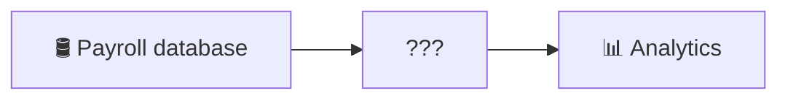
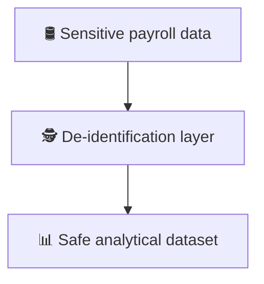
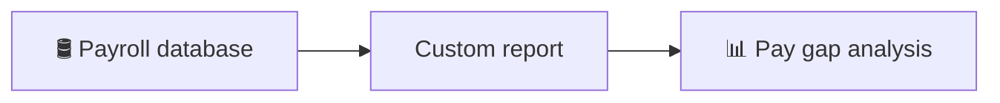
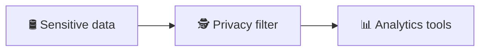
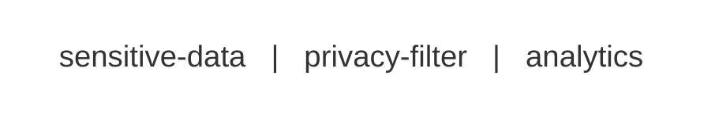

From time to time, a business request arrives that seems
impossible. Not difficult. Impossible.

I encountered one of these years ago while working in a government
analytics unit. A policy team wanted a report measuring gender pay
disparity across the public service, broken down by pay grade. The
request itself was straightforward. Computing the metric would have
taken only a few queries. So I asked for access to the payroll
database.

The answer came back quickly: **“We can’t give you that. That’s private
information.”**

At that point the project stopped. The data could not be accessed
because it was sensitive, yet the analysis required access to the very
information that was being protected. The situation looked like this:

The missing step was obvious. To analyse the data safely, the system
needed a mechanism that could transform sensitive records into an
anonymised dataset suitable for analysis. A simple example might look
like this:

Names and identifiers would be removed or replaced. Pay grade, salary,
and gender could remain. The resulting dataset must preserve the
statistical properties needed for the analysis without exposing
personal information. Once that capability exists, the original
request becomes trivial.

But something more important also happens: the system itself
evolves. The solution is no longer tied to a single report. Any future
analysis involving sensitive data could use the same mechanism.

## Solving the Request vs Evolving the System

When systems encounter requests they cannot satisfy, there are usually
two ways to respond. The first is to solve the request directly:

This approach is quick, but it creates a special-purpose solution. The
logic for handling privacy becomes entangled with the specific report,
and the next analysis request requires another bespoke
implementation. The second approach is different. Instead of solving
the request itself, you introduce the missing capability as a reusable
component:

Now the system has a new expressive power. Any analysis can pass
through the same privacy layer, and the original request becomes just
one of many possible uses. The problem was not that the analysis was
impossible. The problem was that the system lacked the capability
required to make it routine.

## A Familiar Pattern in Software Systems

This pattern appears frequently in engineering. Organizations ask for
outcomes that the system cannot yet produce.

* **“We want reliable deployments.”**\
  But there is no CI/CD pipeline.

* **“We want observability.”**\
  But services emit no structured telemetry.

* **“We want teams to deploy independently.”**\
  But the infrastructure offers no safe deployment path.

In each case, the request seems difficult or unrealistic, but the
deeper problem is usually the same. The system is missing the layer
that would make the request ordinary.

Once the capability exists, the request stops being exceptional.

## The Unix Lesson

This idea closely mirrors the philosophy behind Unix tools. Early Unix
systems introduced small programs that performed well-defined
transformations on streams of data. Each tool had clear inputs and
outputs, and tools could be chained together to perform complex
tasks. A privacy filter for sensitive datasets could follow the same
principle:

The tool does not know which analysis will follow. It only guarantees
a transformation that makes downstream processing safe. The value of
such components lies in their composability. By introducing a
well-defined transformation, the system becomes capable of supporting
new behaviours without requiring new infrastructure each time.

## The Real Role of Infrastructure

Infrastructure is often invisible when it works well. A CI pipeline,
an observability stack, or a deployment platform does not deliver user
features directly. Instead, it changes what the system is **capable of
doing**.

Reliable deployments become **routine**.\
Debugging production incidents becomes **feasible**.\
Sensitive data can be analysed without violating **privacy constraints**.\
What looked like a difficult organizational problem turns out to be a
missing mechanism in the system itself.

## From Workarounds to Capabilities

When confronted with an impossible request, the tempting response is
to build a workaround that solves the immediate problem. But the more
valuable response is often different: identify the capability the
system lacks and introduce it as a reusable
component.

The first approach satisfies the request.\
The second approach makes it [**easy to change**](/posts/2026-03-03-optimise-for-the-cheapest-change).

---

<figure>
  
  <figcaption>
    <strong>Figure 1.</strong> <em>Watermill at Onden</em>, Katsushika Hokusai, from the Edo-period ukiyo-e series <em>Thirty-six Views of Mount Fuji</em>.
    Source: <a href="https://commons.wikimedia.org/wiki/File:Watermill_at_Onden.jpg" target="_blank" rel="noopener noreferrer">Wikimedia Commons</a> (public domain).
  </figcaption>
</figure>
