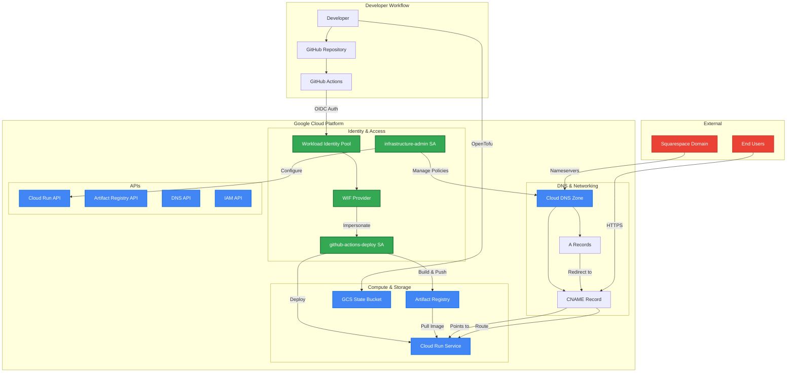
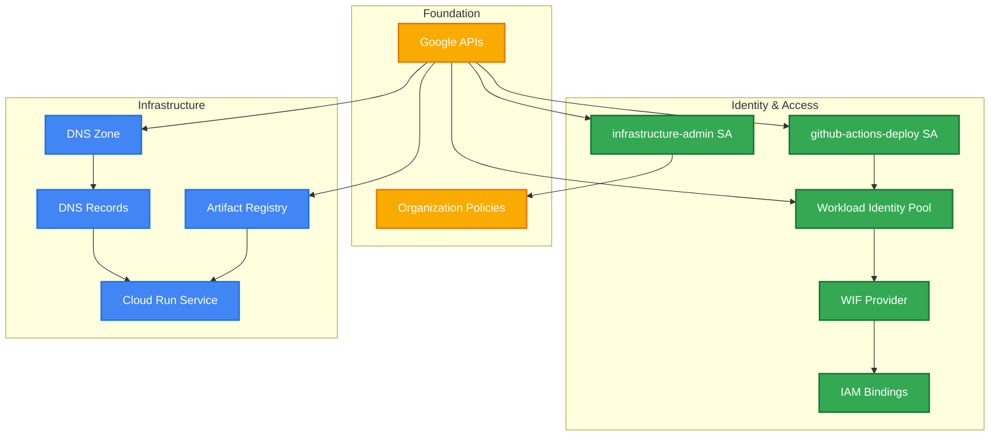
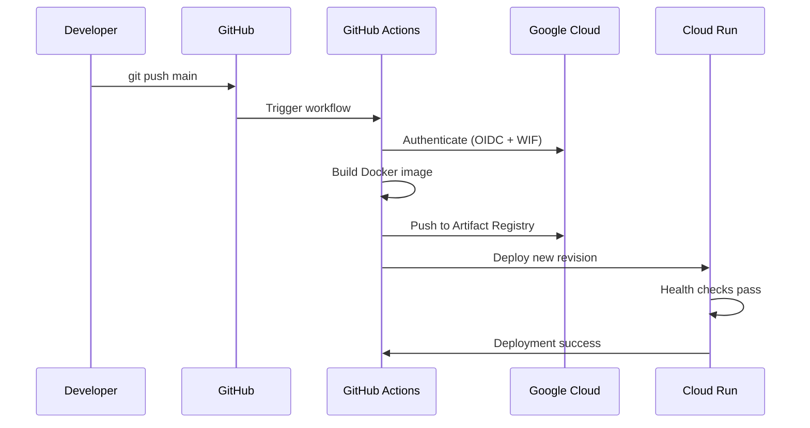
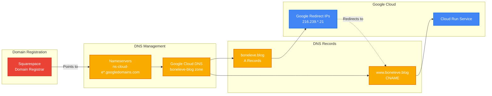
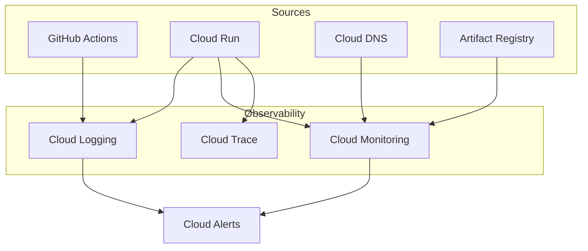

# Infrastructure Architecture

This document describes the infrastructure architecture, deployment processes, and management procedures for the GCP Rust Blog project.

## Architecture Overview

The project implements a **cloud-native, serverless architecture** with full Infrastructure as Code management:



## Core Components

### 1. Google Cloud Run
- **Service**: `blog`
- **Region**: `{YOUR_GCP_REGION}`
- **URL**: `https://blog-{SERVICE_HASH}-{REGION_CODE}.a.run.app`
- **Configuration**:
  - Port: `8080`
  - CPU: 1 vCPU
  - Memory: 512 MiB
  - Concurrency: 80 requests per instance
  - Min instances: 0 (scales to zero)
  - Max instances: 100

### 2. Artifact Registry
- **Repository**: `blog`
- **Location**: `{YOUR_GCP_REGION}`
- **Format**: Docker
- **Images**: Tagged with GitHub commit SHA

### 3. Google Cloud DNS
- **Zone**: `boneleve-blog`
- **Domain**: `boneleve.blog`
- **Records**:
  - `www.boneleve.blog` → CNAME → Cloud Run service
  - `boneleve.blog` → A records → Google redirect service IPs

### 4. APIs Enabled
- Cloud Run API (`run.googleapis.com`)
- Artifact Registry API (`artifactregistry.googleapis.com`)
- Cloud DNS API (`dns.googleapis.com`)
- IAM Service Account Credentials API (`iamcredentials.googleapis.com`)
- IAM API (`iam.googleapis.com`)
- Cloud Resource Manager API (`cloudresourcemanager.googleapis.com`)

## Infrastructure as Code

### OpenTofu/Terraform Configuration

```bash
infra/
├── main.tf              # Core resources and service accounts
├── variables.tf         # Input variables
├── outputs.tf          # Resource outputs
├── versions.tf         # Provider versions
├── backend.tf          # GCS backend configuration
├── providers.tf        # GCP provider setup
├── prod.tfvars         # Production variable values
└── README.md          # Infrastructure-specific docs
```

### State Management
- **Backend**: Google Cloud Storage
- **Bucket**: `boneleve-bucket`
- **Path**: `gcp-rust-blog/infra/default.tfstate`
- **Locking**: Enabled
- **Versioning**: Enabled with 30-day retention

### Resource Dependencies



## Deployment Pipeline

### GitHub Actions Workflow



### Build Process
1. **Multi-stage Docker build** in GitHub Actions runners
2. **Rust compilation** in builder stage with dependency caching
3. **Runtime image** with minimal Debian base and application binary
4. **Image push** to Artifact Registry with commit SHA tag
5. **Cloud Run deployment** with new image and service configuration

## DNS Configuration

### Domain Management Flow



### Current DNS Setup
```bash
# Nameservers (set in Squarespace)
ns-cloud-e1.googledomains.com
ns-cloud-e2.googledomains.com
ns-cloud-e3.googledomains.com
ns-cloud-e4.googledomains.com

# DNS Records (managed by OpenTofu)
www.boneleve.blog.  300  CNAME  {CLOUD_RUN_SERVICE_URL}.
boneleve.blog.      300  A      216.239.32.21
boneleve.blog.      300  A      216.239.34.21
boneleve.blog.      300  A      216.239.36.21
boneleve.blog.      300  A      216.239.38.21
```

### SSL/TLS Configuration
- **Certificate Management**: Google-managed certificates
- **Provisioning**: Automatic upon DNS validation
- **Renewal**: Automatic (90-day lifecycle)
- **Protocol**: HTTPS enforced, HTTP redirects to HTTPS

## Environment Configuration

### GitHub Repository Secrets

Configure these secrets in **GitHub Repository Settings → Secrets and Variables → Actions**:

| Secret Name | Description | Example Value |
|-------------|-------------|---------------|
| `GCP_PROJECT_ID` | Your GCP Project ID | `my-blog-project-123` |
| `GCP_PROJECT_NUMBER` | Your GCP Project Number | `123456789012` |
| `GCP_REGION` | Deployment region | `us-central1` |
| `GCP_WORKLOAD_IDENTITY_POOL` | WIF Pool ID | `github-pool` |
| `GCP_WORKLOAD_IDENTITY_PROVIDER` | WIF Provider ID | `github-provider` |
| `GCP_SERVICE_ACCOUNT` | Deploy service account email | `github-actions-deploy@my-project.iam.gserviceaccount.com` |

**How to find these values:**
```bash
# Project ID and Number
gcloud projects list

# After running OpenTofu, get service account email
cd infra
tofu output impersonated_service_account

# Workload Identity Pool and Provider names
tofu output workload_identity_pool_name
tofu output workload_identity_provider_name
```

### OpenTofu Variables (prod.tfvars)
```hcl
project_id      = "your-gcp-project-id"
project_number  = "your-project-number"
region          = "your-preferred-region"  # e.g., us-central1, europe-west1
organization_id = "your-organization-id"   # Find with: gcloud organizations list
pool_id         = "github-pool"
provider_id     = "github-provider"
github_owner    = "your-github-username"
github_repo     = "your-repo-name"
# Note: service_account_email is automatically constructed from project_id
```

## Deployment Procedures

### Initial Infrastructure Setup

1. **Configure your environment**:
```bash
# Copy template and fill in your values
cp infra/prod.tfvars.template infra/prod.tfvars
# Edit infra/prod.tfvars with your project details
```

2. **Bootstrap GCS backend** (one-time):
```bash
PROJECT_ID=your-project-id BUCKET=your-tf-state-bucket ./scripts/bootstrap-tf-state.sh
```

3. **Initialize OpenTofu**:
```bash
cd infra
tofu init -backend-config="bucket=your-tf-state-bucket" -backend-config="prefix=your-project/infra"
```

4. **Apply infrastructure**:
```bash
tofu apply -var-file="prod.tfvars"
```

### Administrative Operations

Use the dedicated admin service account for organization-level tasks:

```bash
# Organization policy management
gcloud resource-manager org-policies set-policy policy.yaml \
  --organization={ORGANIZATION_ID} \
  --impersonate-service-account=infrastructure-admin@{PROJECT_ID}.iam.gserviceaccount.com

# DNS management
gcloud dns record-sets transaction start \
  --zone=boneleve-blog \
  --project={PROJECT_ID} \
  --impersonate-service-account=infrastructure-admin@{PROJECT_ID}.iam.gserviceaccount.com
```

## Security Considerations

See [SECURITY.md](SECURITY.md) for detailed security architecture and best practices.

### Key Infrastructure Security Features
- **Least Privilege IAM**: Service accounts with minimal required permissions
- **Workload Identity Federation**: Keyless authentication from GitHub Actions
- **Organization Policies**: Control over IAM policy member domains
- **Container Security**: Non-root execution, minimal base image
- **DNS Security**: Managed zone with Google Cloud DNS
- **Network Security**: HTTPS-only with Google-managed certificates

## Monitoring and Cost Optimization

### Current Costs (Estimated)
- **Cloud Run**: ~$0-5/month (scales to zero)
- **Artifact Registry**: ~$0.10/month (storage costs)
- **Cloud DNS**: ~$0.40/month (managed zone)
- **Network Egress**: Minimal for blog traffic
- **Total**: <$10/month for low-traffic blog

### Resource Monitoring


This infrastructure provides a robust, secure, and cost-effective foundation for the Rust blog application with full automation and monitoring capabilities.
